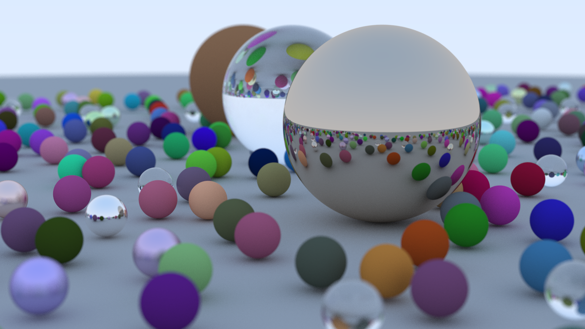

# Ray Tracer

A simple ray tracer following the amazing tutorial by Peter Shirley et al. ["Ray Tracing in One Weekend"](https://raytracing.github.io/books/RayTracingInOneWeekend.html). Implementation is done in Rust.

### Examples

### Runtime Performance
Rendering the final scene (1200x675 image with 500 samples per pixel and 50 max depth) on an AMD Ryzen 9 5900HX CPU and 16GB of RAM:

| Implementation         | Time        |
|------------------------|-------------|
| Rust (multi-threaded)  | 2min 21sec  |
| Rust (single-threaded) | 16min 53sec |
| C++ (single-threaded)  | 27min 31sec |

- Multi-threading in Rust is done through [Rayon](https://github.com/rayon-rs/rayon), which shows an excellent scaling on an 8-core CPU.
- The C++ is the [reference implementation](https://github.com/RayTracing/raytracing.github.io) complied with GCC 11.4. This implementation prioritizes simplicity over performance.
